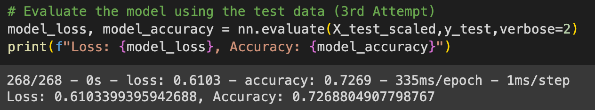
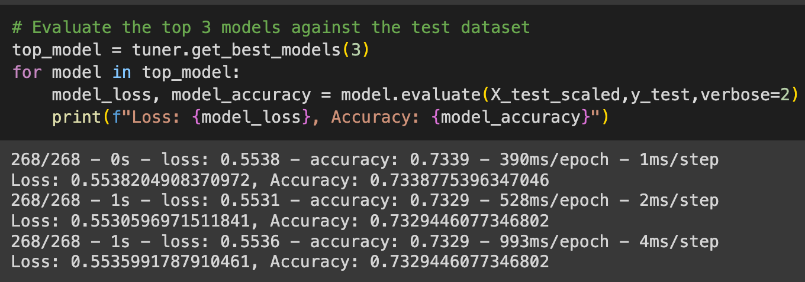

# Neural Network Model Analysis

## Overview

The purpose of this analysis is to create a tool that can help Alphabet Soup, a nonprofit foundation, select applicants for funding with the best chance of success in their ventures. I leveraged my knowledge of neural networks to create a binary classifier that can predict whether applicatnts will be successful if funded by Alphabet Soup.

To power and form this classifier, I used a csv provided by Alphabet Soup's business team that contained more than 34K organizations that have received funding over the years. The dataset included a number of columns but I focused on `IS_SUCCESSFUL` as my target variable.

## Results

### Data Preprocessing 

* Target variable: `IS_SUCCESSFUL` - was the money used effectively
* Feature variables:  
                          *`APPLICATION_TYPE` — Alphabet Soup application type
                          *`AFFILIATION` — Affiliated sector of industry
                          *`CLASSIFICATION` — Government organization classification
                          *`USE_CASE` — Use case for funding
                          *`ORGANIZATION` — Organization type
                          *`STATUS — Active status
                          *`INCOME_AMT` — Income classification
                          *`SPECIAL_CONSIDERATIONS` — Special considerations for application
                          * `ASK_AMT` — Funding amount requested
* Removed variables: `EIN` and `NAME` were dropped as they were non-beneficial

### Compiling, Training, and Evaluating the Model

* My first attempt at a model was fairly random:
    * Layer 1: hidden node = 23, activation = "relu"
    * Layer 2: hidden node = 7, activation = "relu"
    * Output Layer: node = 1 (since this is a binary classifier), activation = "sigmoid"
    * __Results__: 73% accuracy
    
    
* For my second attempt, I tried to increase the accuracy by increasing the node values for my first two layers and changing one of the activation functions. 
     * Layer 1: hidden node = 50, activation = "relu"
     * Layer 2: hidden node = 20, activation = "sigmoid"
     * Output Layer: node = 1 (since this is a binary classifier), activation = "sigmoid"
     * __Results__: 72.8% accuracy
    

* For my third attempt, I added another layer, changed node values, and experimented with changing activation functions. 
    * Layer 1: hidden node = 81, activation = "relu"
    * Layer 2: hidden node = 33, activation = "sigmoid"
    * Layer 3: hidden node = 18, activation = "relu"
    * Output Layer: node = 1 (since this is a binary classifier), activation = "relu"
    * __Results__: 72.7% accuracy
    

* After my manual experimentation actually resulted in worst results with every attempt, I installed Keras Tuner to optimize my model and find the best set of parameters. The tuner found three models that produced the highest accuracy:

* Despite my efforts, I wasn't able to get my accuracy score past the 75% threshold. 

## Summary

The highest accuracy level I was able to achieve was as a result of using the Keras Tuner at 73.4%. Ideally, I want to find a model that gets us above 75% accuracy. For a following iteration, I would try different ways to clean the data (should we keep the columns we dropped?) and continue to use the tuner to identify the best results. Additionally, research tells me that Gradient Boosting Machines (GBMs) could be another model to use that could increase accruacy but may sacrifice interpretability. It'd be good to compare these two models to find the results at the end of the day.
